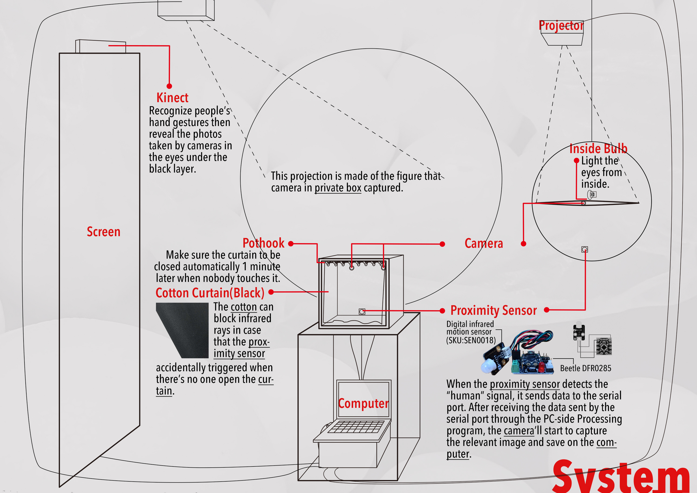

## DAY 1: Privacy Alert!!

"The consequences of every act are included in the act itself."

                                 -- George Orwell, *1984*
                                 
"Google knows what you're looking for. Facebook knows what you like. Sharing is the norm, and secrecy is out. But what is the psychological and cultural fallout from the end of privacy?"

                                 -- The Guardian
                                 

There are more privacy disclosure than you could ever notice.

People pefer to know about others' personal life than letting others to know about theirs.

3 Design Directions:

·Tell people that our privacy is easy to be attacked without noticing. (in a way they could directly perceived)

·Make them think: How do you like the feeling of peeping at others or being peeped?

·Tell people: Be aware of disclosure of your own privacy and respect others.

