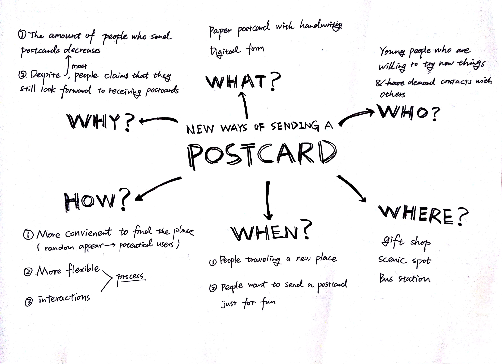

## DAY 2 ：POST
In the past, writing letters and sending postcards are used to be very imprortant for people to bond with each other. Nowadays, we entered the imformation age. More and more young people choose to communicate through social apps, which results in the decreasing amount of people who are willing to send postcards. Meanwhile, there’s still something valuable and irreplaceable about postcards, since the connection they brought has more memorable meaning than the words we simply typed and sent with the online social media.

So I did a research to find out what things made more people stop sending postcards and what can we do to bring postcards back to daily life.

### A User Map of Sending Postcards

### Brain Storming

### Concept Sketch

