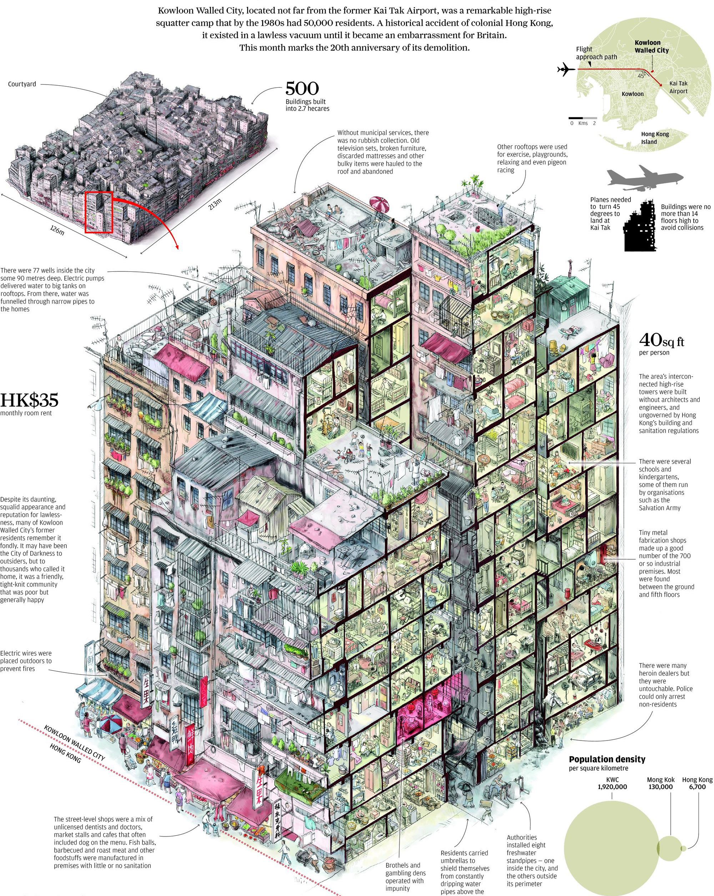
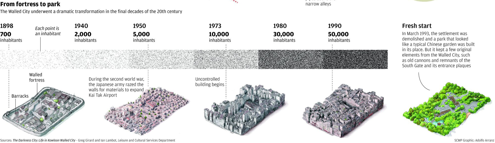
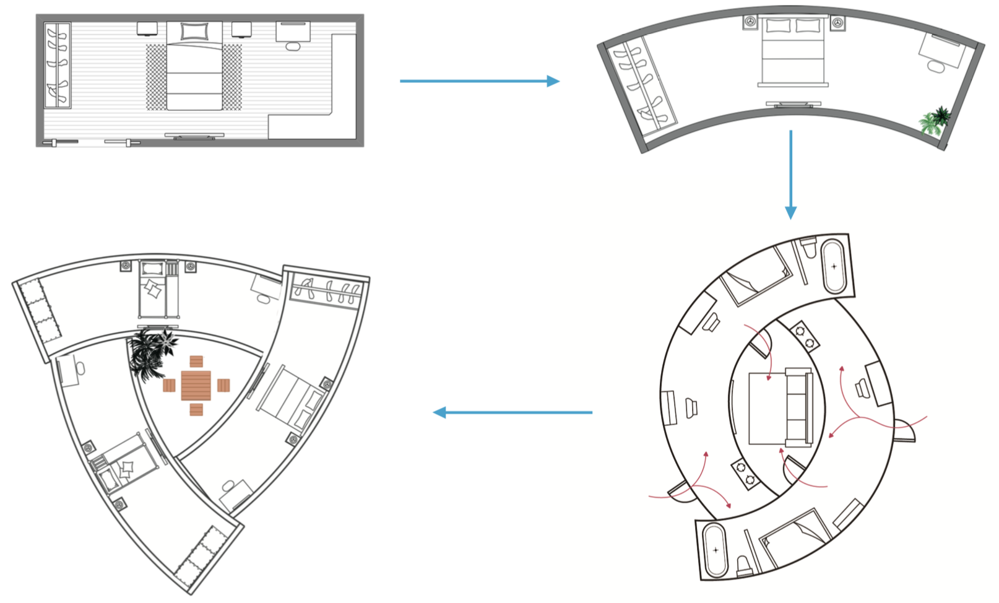
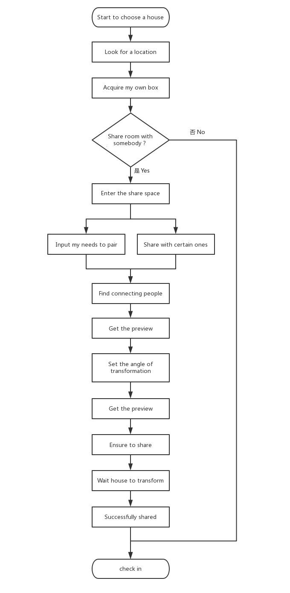

## DAY3 : Life Sharing
### Inspiration

The “shared life” model has gradually increased its attention around the world in recent years. People who don't know choose to share the same space and live together for economic purposes and want to make friends. From the current point of view, this unique and attractive life style is sought after by young people. Nowadays, the “vertical” building structure has almost completely replaced the “horizontal” building structure. This urban distribution structure has had an obvious impact on the social form, and the relationship between people’s regions and groups has gradually disintegrated. From the previous housing interdependence to individual housing independence. And I hope that under the continuous development of residential building forms, people can still maintain the close communication relationship before, and the communication between people and the changes in the social form will not change due to the building mode of the house.

### Hypothesis

