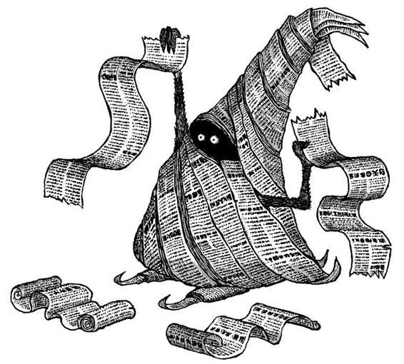

## DAY 4 : "Live" Newspaper
### Inspiration

“Live Newspapers - fleet-footed dwarfs dressed in their traditional galleys - hawked the latest literary gossip and scuttlebutt through the streets and charged passers-by a modest fee to read the reports on their strips of newsprint, for instance:

**Heard the latest?** Gopak Trembletoes has auctioned his novella, Lemon Icing, to Nodram House, Inc.

**Believe it or not!** The editing of Ogdon Ogdon’s novel, Pelican in Pastry, is going to take another six months!

**Outrageous!** The last chapter of The Truth Drinker by Fantotas Pemm was lifted from Kaira Prudel’s Forest and Folly!”

-- Walter Moers. *The City of Dreaming Books*

### Idea
