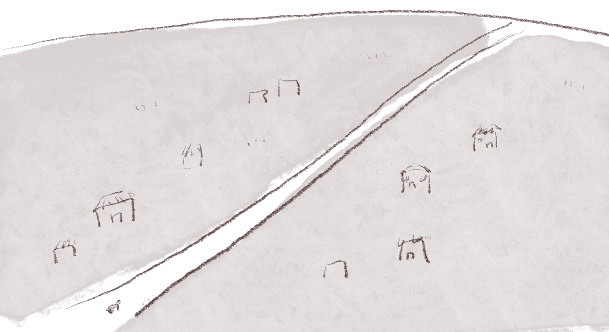
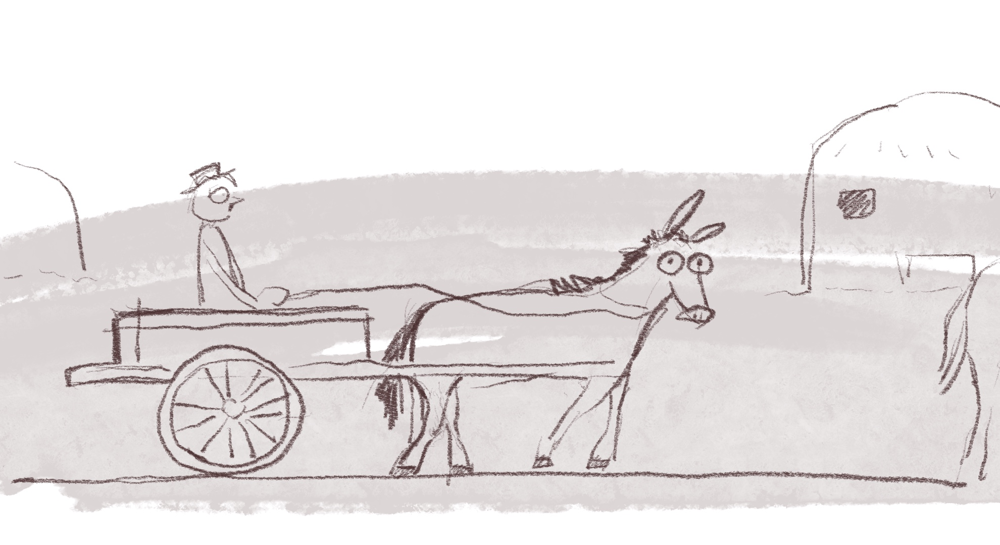
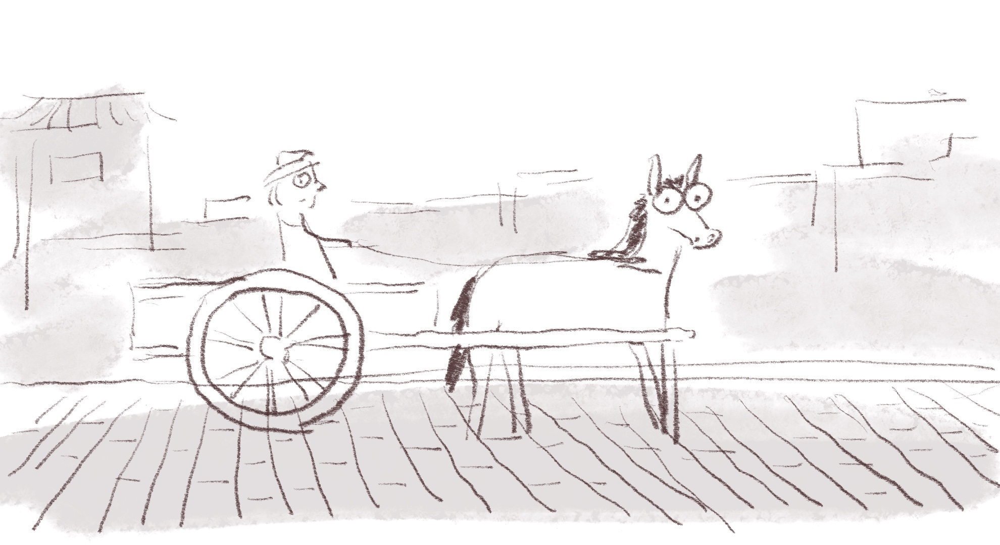
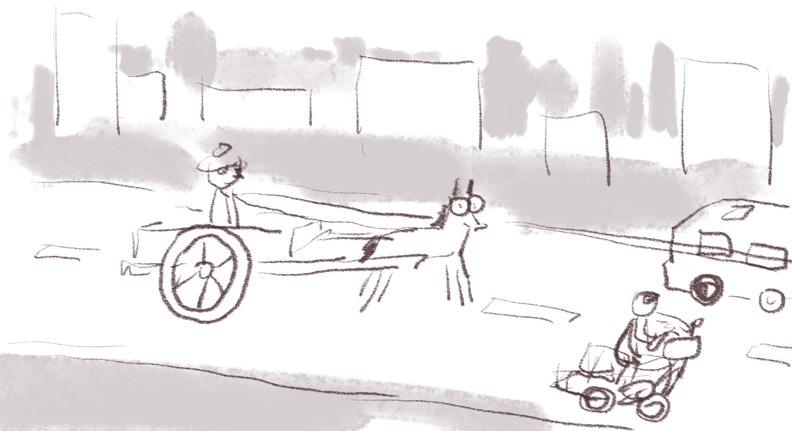
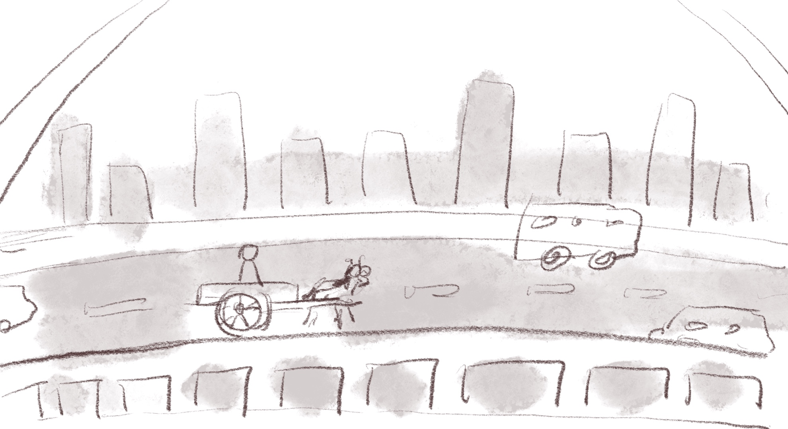
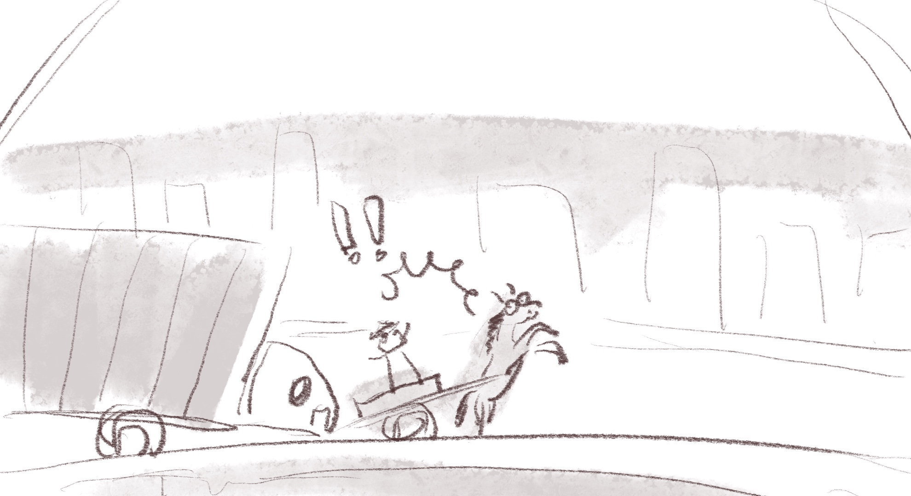
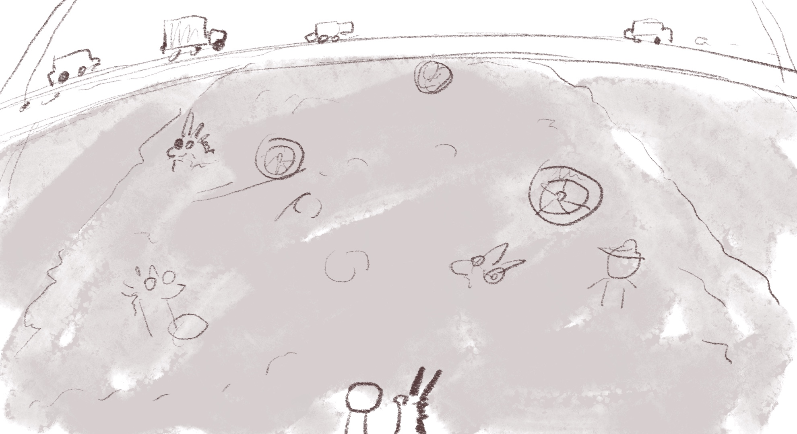

## DAY 5 : Donkey Cart on the Highway

Sometimes it's hard to follow the face-paced trend of this information age. I am a "slow" person, this is what I'm feeling right now: 

like a donkey cart on the highway.

So I came up with this story and wanted to make it a short animated film.

### pieces of Storyboard

(A view of a village)

(A close scene of the donkey cart)

Background change: from a few thatched cottages into brick houses.

(imply the change of ages)

Background change: highway

The donkey cart was hitted by a truck and fell out of this viaduct.

The man rise his head and see many mountains of donkey carts at the bottom of this viaduct.
