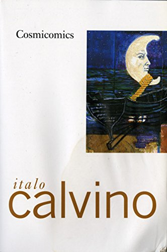
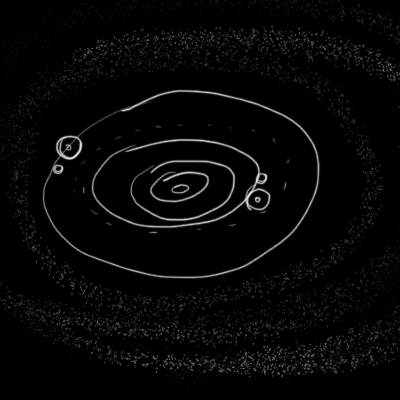

## DAY 6 : a Game without End

### Inspiration
This is a chapter from one of my favorite writer Italo Calvino. 

*I was only a child, but I was already aware of it, -- Qfwfq narrated, -- I was acquainted with all the hydrogen atoms, one by one, and when a new atom cropped up, I noticed it right away. When I was a kid, the only playthings we had in the whole universe were the hydrogen atoms, and we played with them all the time, I and another youngster my age whose name was Pfwfp.*

*What sort of games? That's simple enough to explain. Since space was curved, we sent the atoms rolling along its curve, like so many marbles, and the kid whose atom went farthest won the game. When you made your shot you had to be careful, to calculate the effects, the trajectories, you had to know how to exploit the magnetic fields and the fields of gravity, otherwise the ball left the track and was eliminated from the contest.*

*The rules were the usual thing: with one atom you could hit another of your atoms and send it farther ahead, or else you could knock your opponent's atom out of the way. Of course, we were careful not to throw them too hard, because when two hydrogen atoms are knocked together, click! a deuterium atom might be formed, or even a helium atom, and for the purposes of the game, such atoms were out: what's more, if one of the two belonged to your opponent, you had to give him an atom of your own to pay him back.*

*You know how the curve of space is shaped: a little ball would go spinning along and then one fine moment it would start off down the slope and you couldn't catch it. So, as we went on playing, the number of atoms in the game kept getting smaller, and the first to run out of atoms was the loser.*

### thoughts

I want to make a board game with this concept.

