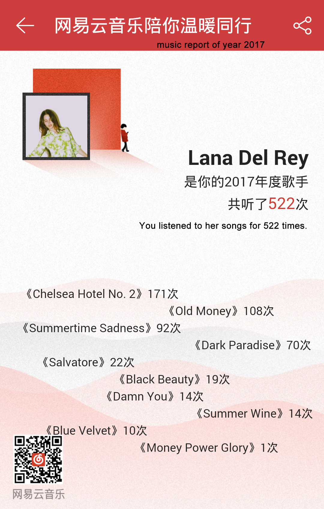
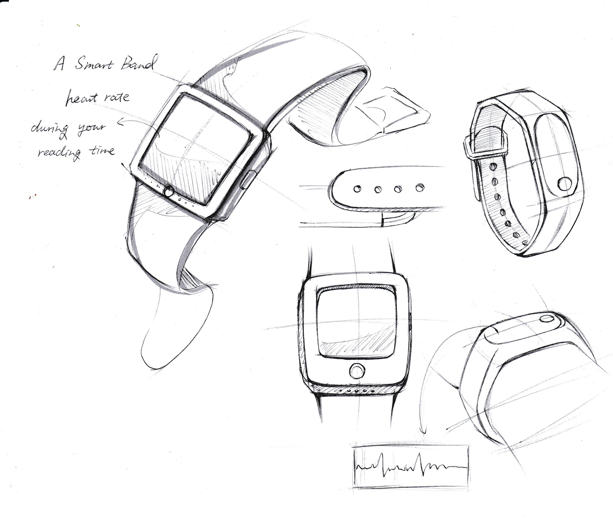
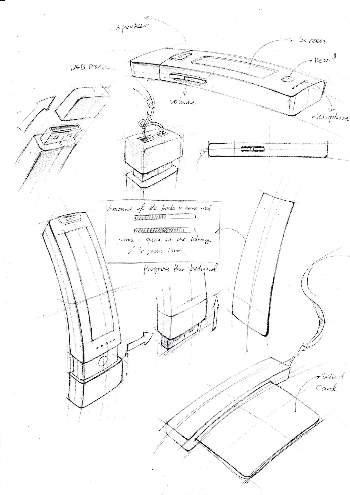
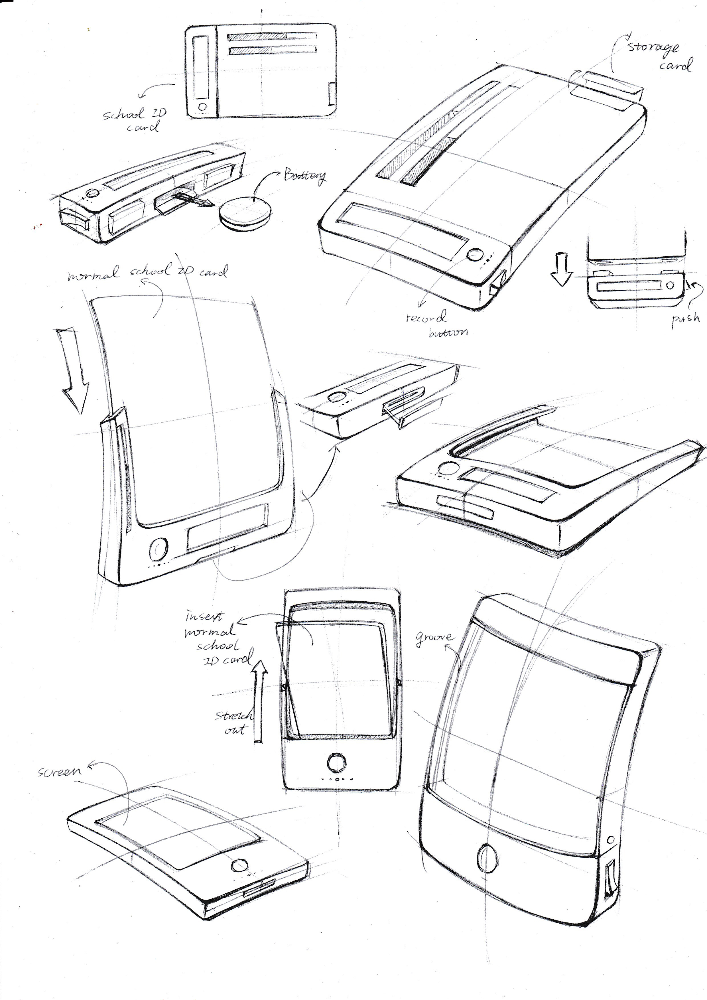

## DAY7 : Library Card Level up!

### Inspiration
Many apps has this funtion to sum up your last year's achievements.

I want to make a slight development of the library card. Combining the storage card and the borrowing card can record the length of time and route after entering the library, which can be quantified as a progress bar and data, so that the process of learning and reading can give users positive feedback faster. At the same time, it has a recording function, which is convenient to record mood and feelings, which can be carried with you and appear in life naturally. It also has a commemorative meaning, like a diary that can be read many years later.

### 3 thoughts
1. 
2. 
3. 
