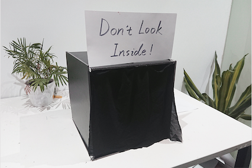
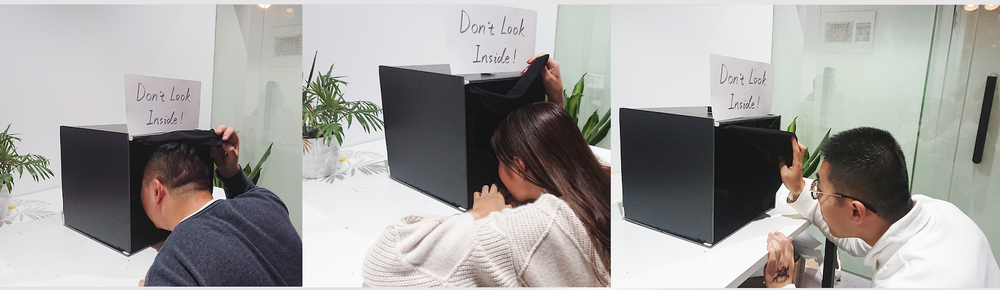

## Post Mortem

I realized I did not fully present my ideas in the portfolio 7 in 7. So I’d like to explain something from the feedback questions:

“Day 1 Privacy in what context? Medical records, social networking, address/data/financial information data selling from providers? That specificity will also guide the form a bit. Prototype can help you test the assumptions a bit - what would people come out feeling after using your installation? How would you test whether it matches with what you were thinking?”

Day 1: I can narrow down my context into a short sentence: 

When you are spying on others, others are also spying on you. 

That’s the message I want to send with this installation. I found an interesting thing when I did a few researches about people’s attitudes towards privacy. Most people said they often read about others’ personal lives at social platforms (almost every day, it gradually becomes an entertainment during leisure time), but most of them only occasionally post something about their lives and said they don’t want other people know too much about them. I actually did a simple prototype about people’s curiosity towards other’s privacy. I did a test to see how people would react to a box with a sign says:”Don’t look inside!”I hided and observe. I found that passengers were all curious about what’s inside the box then peeped at it. 

So I followed this scene and made this installation. At first I came up with three different independent schemes. Later I found that each scheme has its merits and combined to better express my theme. Then I drew a storyboard to depict the entire interaction process, and then did a system map to figure out how each function works. I can do further tests but I didn’t get the time because this is a lot work so I only did simple prototypes.

Day2:

“If a digital platform like helps you send postcard easily, why would a vending machine be needed? Is there a specific info such post cards need to reflect? What specific role does the bus station play here? What do you want the receiver/sender to think when they get/send the card? How do you equate this to the practice of sending practice to yourself when one is in traveling in a new country?”
I associate postcards with tourism when doing brainstorm, because many tourist attractions have small shops selling postcards with special pictures. People often want to send postcards to family, friends or themselves in these places as a souvenir. The reason I chose the bus station is that this place is easy to be found. Since many people thought the procedure about “buying postcards and finding postoffice to send them” is way too bothering. Also, if I set this product at bus station, when people waiting for the bus get bored, they could use my product to kill time. 

Day3: “Are you proposing a new common space? There are already many common spaces with games, TVs, studios etc. in a vertical building. It seems you started your argument wiht horizontal building to suggest that people used to be in close communication. Now after vertical, where there are indeed physically close, they are not? Why this dichotomy? And if horizontal houses that were far apart brought close together, how will this co-working do the same? Is physical distance the most crucial factor for people to be in communication -- what's the role of our electronic media?”

Yes, I think I need to think about all those questions, they are critical and crucial!
I am actually proposing a likely way for young people to live in the future. From "private" to "share". In recent years, the new living model of "shared community" has attracted people’s attention. Now there are too many things that people own. The current houses are just for stuffing, not for activities and communication. The home we envisioned It is a semi-open space. Everyone takes out part of their space and items to share. Although their private space is reduced, everyone gets a larger shared living space, which can promote interpersonal interaction.

In the future, social mobility is extremely strong, people's lives will tend to be flexible and changeable, and with the highly developed technology, people's demand for real communication will further increase, so those who have more flexible living conditions and hope to be able to socialize easily People are our target users.
A large part of our users come from renters. The number of renters in my country alone will reach 270 million in 2020. The proportion of renters in other countries is also increasing year by year, and the trend of flexibility in life is becoming more apparent. Coupled with part of the permanent population, the user base of the shared community will be very large.

The changes are mainly reflected in three aspects:

1 social object is different.

The traditional social:social foundation is mainly based on kinship or kinship. Based on this, we have a very passive choice of social partners and will become your relatives, neighbors, classmates, and colleagues whether or not you like it, and for many years constant.
In the age of social media:the foundation of social interaction is mainly the collaboration generated by the contract and the community of hobbies. You are free to choose which way and who to take to communicate and collaborate.

2 social costs are different.

In traditional societies, getting to know a person requires a suitable occasion, a particular referrer, or even a long-term commitment.

In the age of social media, just tap a finger in a community or send a private letter.

3 different depth of social.

The traditional society whether students or colleagues, have a common social circle, as long as there is a circle of people have far exceeded others' basic trust.

Social media age, easy attention or friend application, not only lack of basic trust, and may even be out of malice. (Of course, the current fiery WeChat app just saw this, creating a social circle based on the premise of trust, it has a competitive advantage)

Based on this change, in the hypothetical phase, we give three suggestions on product architecture from the perspective of life (passive) and development (initiative) respectively.

1 grasp the social distance. 

Social media does not change the basis of trust, so trust still needs to be gradual. There is a need to be clearly aware that the people who meet in social media are fundamentally different from those who know in traditional societies. Of course, the distance produces beauty, but also need to give each other a certain amount of private space.

2 Filter social objects. 

Internet reduces the cost to increase the channel, social become easier than ever before, but people's attention is limited. Therefore, in the social media era, not only the social and social choice, but also social objects to be graded. Who is suitable for sharing hobbies, who is suitable for communicating work, and who is fit for speaking emotions. According to the production needs of the classification, to select the object / neighbor.

3 social resources. 

It is hard to break the habit of comfort zone, many people will choose to maintain the habit of social habits, but young users tend to be more willing to try new ways.

On the basis of how we advocate the "shared life" model, we also need to have suitable and feasible environmental scenarios. Take Beijing’s old hutong as an example. It is a shared life model that is worthy of reference. The neighbors in the street seem to be a family. The whole hutong is a huge family residence. The street is their shared community. People come and go freely and freely. Use, this kind of living atmosphere not only satisfies individuals to have their own private space, but also meets people's needs for social contact. It is a feasible and easy-to-accept model. Buildings, to a brand-new future life model.

Day7: “Why would such a data recording be needed?”

We may seldom realize that we ourselves get various rewards from digital products every day. These rewards are not always obvious, and the most subtle rewards are usually more effective.

Different rewards are presented in different forms and have different effects, but the root is always to maintain emotional resonance with the user, so that the effect will occur. The more obvious the emotional resonance, the more successful the reward. I want to add this reward-like system into the library card to encourage people read more often. Reading is not something that can give you instant reward. Some people read a few books yet said they didn’t remember anything. So I think this is a way to help them see their progress. 

Thanks for the feedback and I really thought a lot about those questions. I agree that my contents of exploring are too board. Firstly, I will try to narrow down my targets. I can dig deep to each topic and find an entry point then refine my concept. Then I will take more time letting audience test my prototype and watch their feedbacks. I need to record them using a camera or something else. 

I somehow really like the old things. And I want to see how technology can change them. In the contemporary society, our lives are filled with new kinds of technologies, which is a good thing but I believe the humanity is also supposed to be highly regarded. That’s why I’m longing to figure out how designing could make the humans and city system interact in a more joyful and meaningful way.

In the beginning of my study, I’m about to have a certain category of my target users and a certain direction of which part of the system I’d like to make a progress with. I need to look for some references according to the relevant books or other research materials. Then I’m supposed to think of several different ways to accomplish my goal (such as using an interaction installation or media). To test my design, I’m supposed to use some research skills. I may have to do some prototyping to demonstrate my thoughts. Then I will have my users to help me test. After that, observe the user’s behaviors when they interact with the devices.

I know there’s a dynamic course of Interaction design communication provided for students. The course offers a chance for us to understand the scope of design methods to work critically and interdisciplinary across a range of media, technologies and applications. I’d like to gain more advanced skills of interaction design and combine them with insights into human behaviors in the future study term. I believe it will be beneficial for my intend project.

