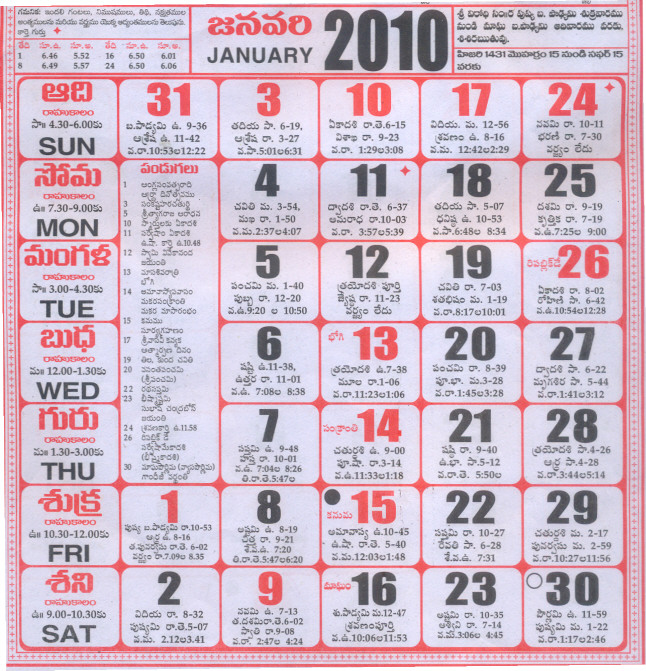
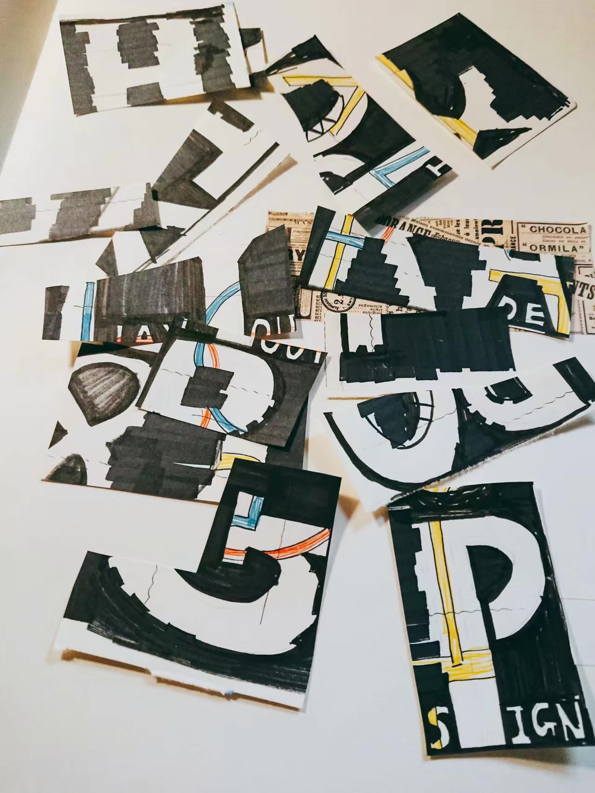
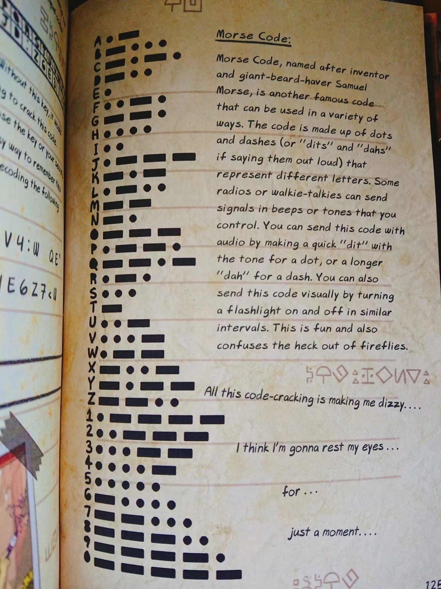
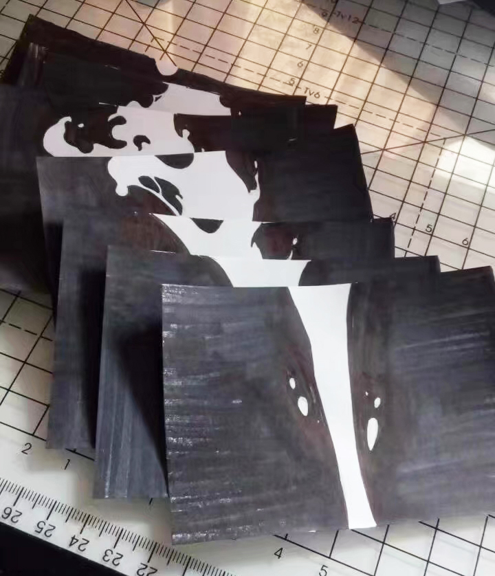
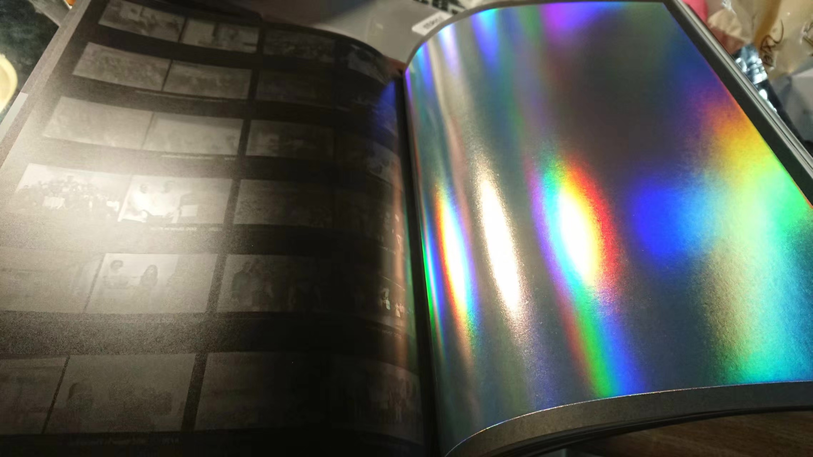

# iteration
## Book

Last week after 1:1 meeting I decided to choose one thing I like to present my idea. Also, Harpreet told me that I don't have to use technology if it has conflict with my work. I really like graphic design and eventually I decided to make a book about information lag. I want every chapter to tell one story or make people think something about information lag.

Here are some thoughts for my book:

### Chapter 1. Calendar of 2010

### Chapter 2. Puzzles

### Chapter 3. Flip Animation

### Chapter 4. Story of Postcards

.jpg)

### Chapter 5. The Light-Year

