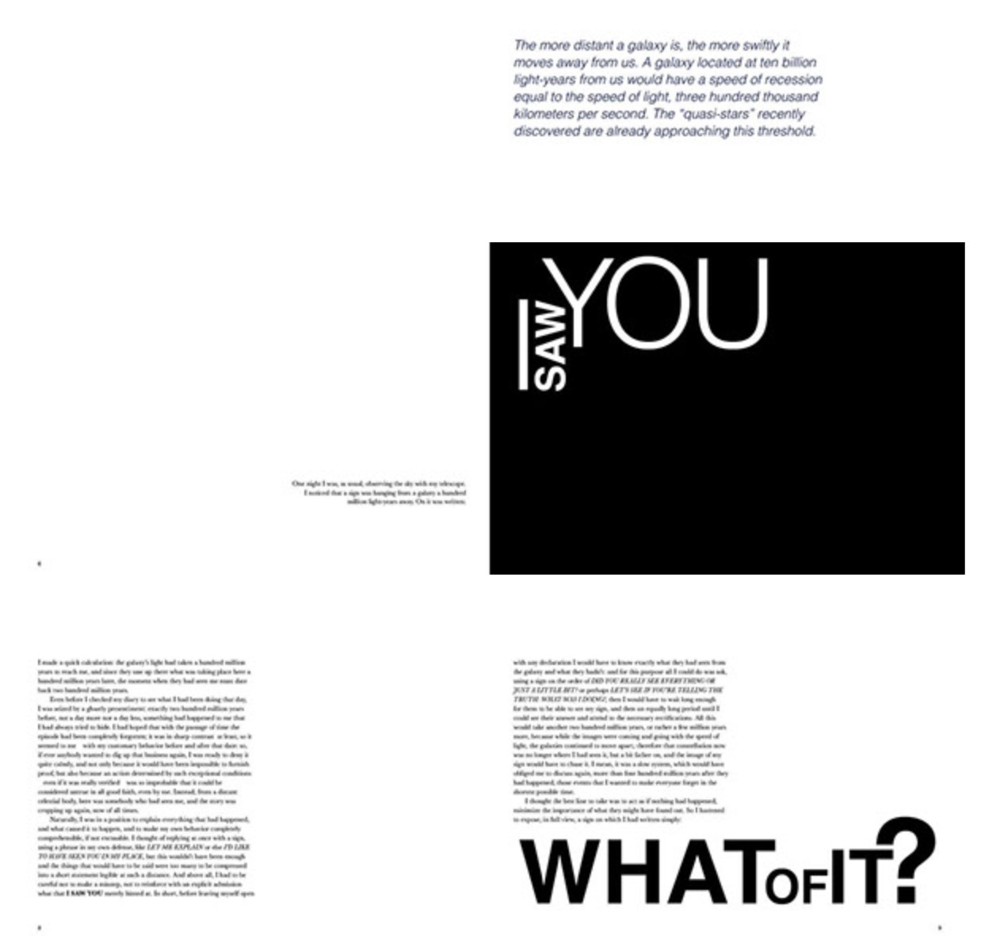
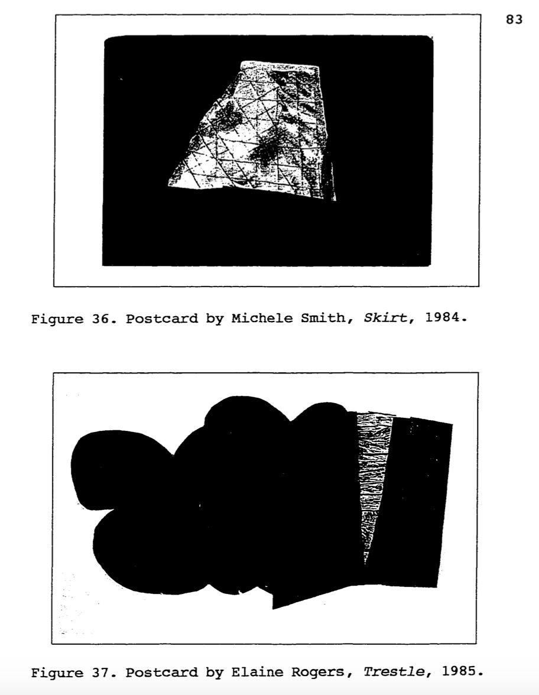
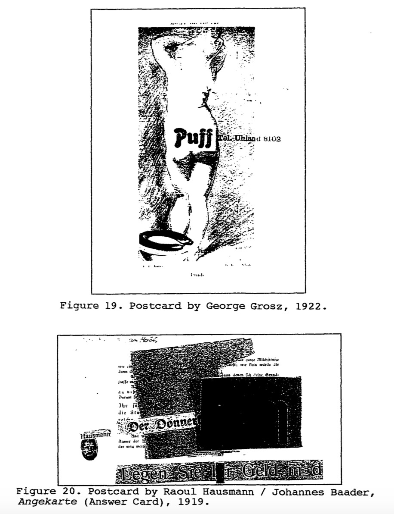
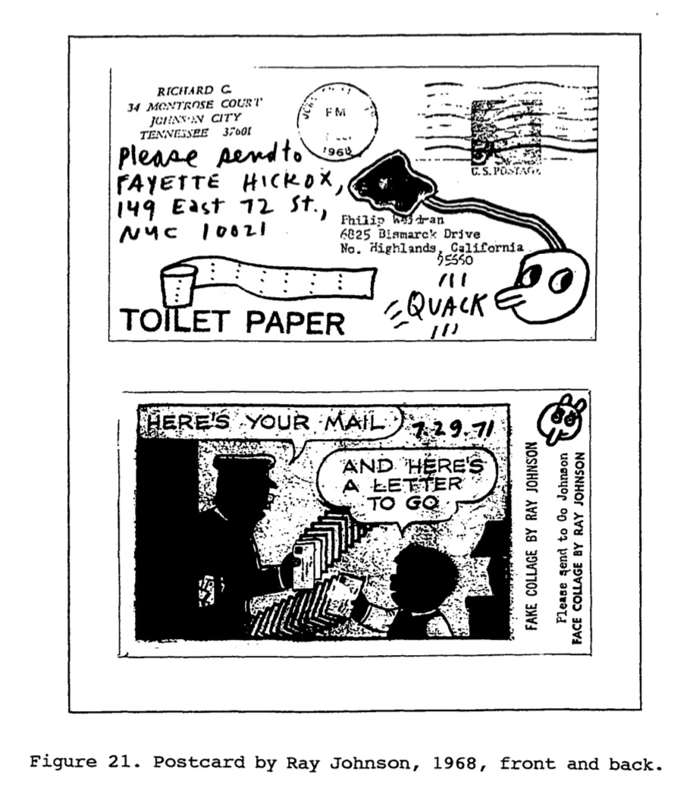
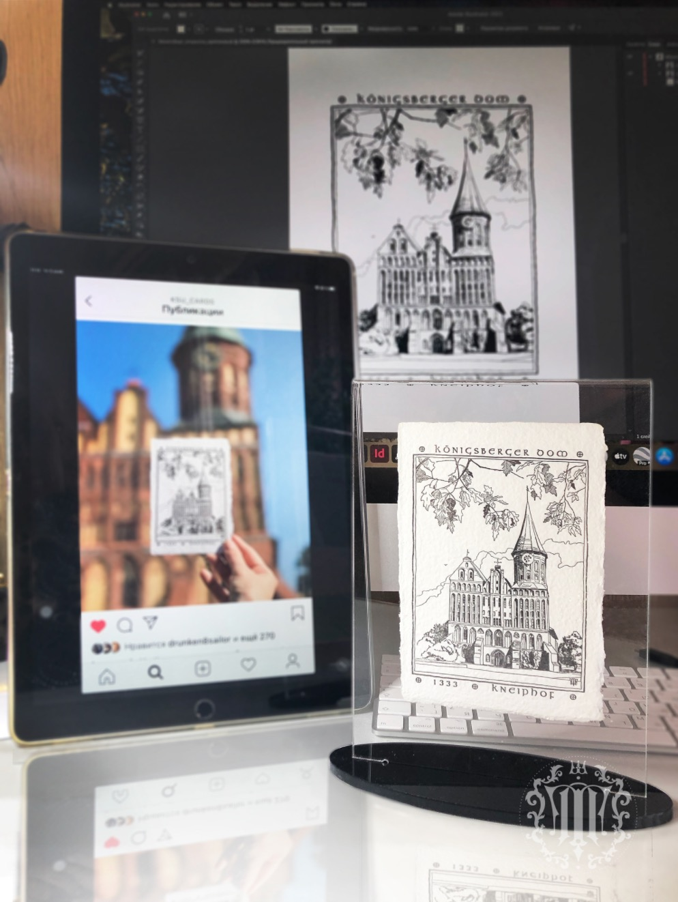
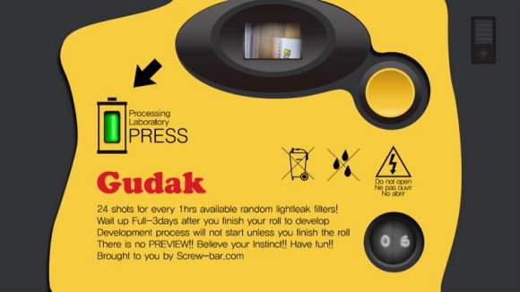
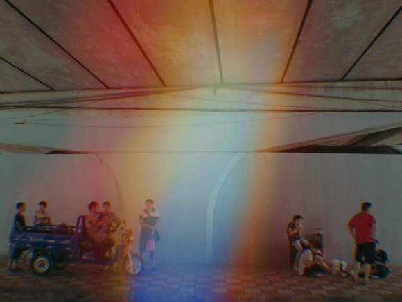
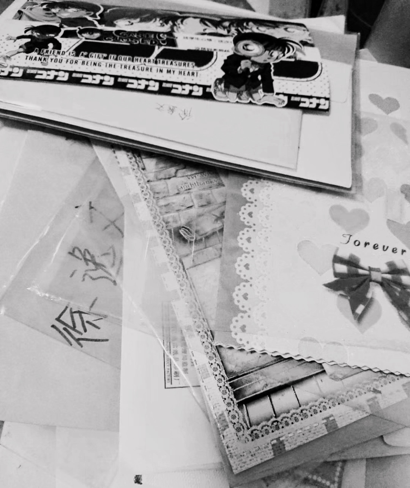
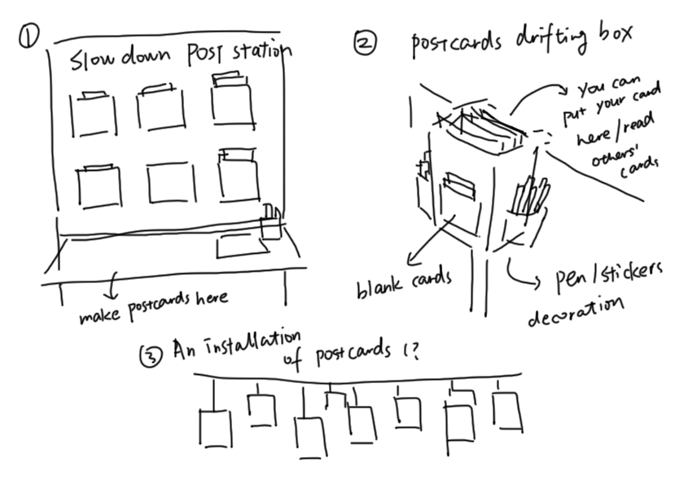

## Research

Last class we talk about our projects. I’d like to explore more about the postcard and use the postcard as an intermedia to design something. After the discussion, I realized the main difference between paper postcard and digital media is that when you send a picture or a message to others, they can get the information instantly. But it can take a lot of time if you send a postcard or a letter by mailing. 

Students in my group also said that if someone sends a postcard from a distant place, the receiver may receive the card several months later. It’s interesting because the message he received will become something from the past. And the sender may change his/her mind during this time period. This actually reminds me of one chapter “The Light-Years" from the book Cosmicomics by Italo Calvino. 

This story is about a man trying to communicate with people from far-away planets of the galaxy. The man was looking through a telescope and saw a sign on a planet that says "I saw you." He realizes the communicator must have seen him exactly two hundred million years ago, when he was caught in an embarrassing situation. He could explain the situation, but he can't communicate the complex story across the distance, so he put up a sign : ”What of it?” And hopefully after two hundred million years the people will see the sign.

The story shows us a drama caused by information lag. Sending a postcard has the same feature.

I want to do a research about the slow process of sending a postcard and how will this benefit more than sending digital messages with a smart device. 

### User map of sending a postcard:

### The sender:

· get a postcard

This can happen when you are traveling to new places and you want to tell your friends. You can buy a postcard with the picture of local attractive scenic spots and historic sites. Many gift shops offers this kind of souvenir. 

Or you did not go anywhere far, you just found some beautiful postcards online or the store near your home and you want to give them to your friends as a holiday gift. 

The third possibility is that you design some hand-made postcards by yourself. 

I found some postcard art projects through the research. These are made by the artist members of 1708 EAST MAIN. 

“It offered a unique challenge to the individual artists to experiment with a prescribed scale, printed reproduction, as well as historical and popular cultural art themes. The actual postcards also presented the gallery and the individual artists with a tool for education, promotion, communication and documentation. The potential for postcards to be viewed as an alternative to the standard gallery /museum viewing experience could be contemplated.”

Kaliningrad, Russia (old name of the city is Kenigsberg) by Taty Payansky.  The drawing for the postcard has turned into the design of all kinds of printed materials.

· find a place to send

Go to the post office or just find a mailbox on the street. If you choose this old fashion way, you may need to buy some stamps. It can also add something fun to your postcard.

### The receiver:

· get the message from the sender (or not)

· Find the postcard

Students in our group came up that finding your postcard in a large amount of letters and cards in the school Package Deliver & Pick up Station is an interesting process.  

· Postcard lost in the way of delivery

It happens when the sender use a mailbox to send the postcard in an ordinary way. 
Then we’d never know about that card. It will disappear or be found by someone else someday. 

### The slow down moment in fast-paced life

We now live in the information age and the life speed is very fast. Still, there are some “slow down” moments that for us to take a break or bring us back to the past. 

https://www.youtube.com/watch?v=qui_P7672OA

Animal Crossing New Horizon is a very popular game in 2020. The design of this game is simple. It completely simulates the real life, unlike other games’ complex level systems, you do not have to do anything if you don’t want to in Animal Crossing. In this game, you need to do a series of actions to accomplish a certain behavior. In some other games, buying stuff in the item store only need some 2-3 clicks on the screen. But in Animal Crossing, the process will take you more time.  Firstly, you need to find the Nook shop. The salesmen will welcome you and talk to you when you enter the Nook shop. Then you need to open the sideboard and check for the stuff you want to buy. You can also shop online, but the item you brought will be sent to you the other day (the time is same as the real life). The producer of this game intended to create a unique environment for people to slow down and enjoy the game. They spend a lot of time to make the 3D model and the background music. Every moment in this game is like a beautiful painting. 

There are also products that simulate the old film camera. Like Gudak Cam. Open it after downloading, you can see this interface, there is always a super invincible small viewfinder, the purpose is to make you can not see what you are shooting. 

First, you will get a roll of film that can take 24 photos. When this roll of film is used up, you will have to wait an hour before you can get the next roll. After shooting a roll, your film needs to be "processed" for 72 hours to see the photos, which is also the most interesting part of this camera. As for why it is 72 hours, the design team said that it took a lot of pains. 72 hours happens to be a forgotten point in your memory. When you see the forgotten photos again, you will get a surprise. This is true in my own use. It is so. The "developed" photos are imitating the film style, and there will be random light leakage.

### Story about me and postcard

I transferred to a new school when I was in grade 5. To a new student, the first week is horrible. I remember an art class at the first week, teacher told us to make gift cards by ourselves and give them to someone you want to give. I was new to this school and I knew nobody, so I did not make any card. I didn’t expect to receive any cards, either. But I was surprised to find that many students gave their hand-made cards to me even though I was new and some of them couldn’t spell my name correctly. I was so moved, I almost cried. 

Back when I was at primary school and middle school, students used to exchange gift cards before big festivals. It is a poetic and memorial tradition. Sometimes our school will send postcards to our home. 

I have kept all the cards I received for many years. Some of my friends still kept the cards I gave to them. 

The first time I actually sent a postcard to a friend from a distant place is when I was in grade 8. The funny thing is, I sent them to three people, only one of them eventually received the card. The other two cards - I guess they were lost by the mailman or something. That happens when you use the mailbox to send postcards. 

I have received postcards from Sri Lanka, Britain and other places. Most of them are postcards with pictures of local attractive scenic spots and historic sites. 

.jpeg)

After I went to college, I have sent a postcard to my math teacher at middle school. It was supposed to be the gift for Teachers’ Day, but the mail didn’t arrive on time. A few days after the Teachers’ Day, she received that card and the gift. She was still very touched and feel like it was Teachers’ Day all over again! It is the beauty of information lag! 

### sketch

reference:

Le Cosmicomiche title listing at the Internet Speculative Fiction Database (ISFDB). Retrieved 11 March 2012.

The postcard art project. Dobyns, Rebecca Mae. Virginia Commonwealth University, ProQuest Dissertations Publishing, 1999. 1395925.

Text with a view: Turn-of-the-century literature and the invention of the postcard. Cure, Monica. University of Southern California, ProQuest Dissertations Publishing, 2012. 3542229.

Gudak Cam. Screw Bar Inc. https://apps.apple.com/us/app/gudak-cam/id1237692856

